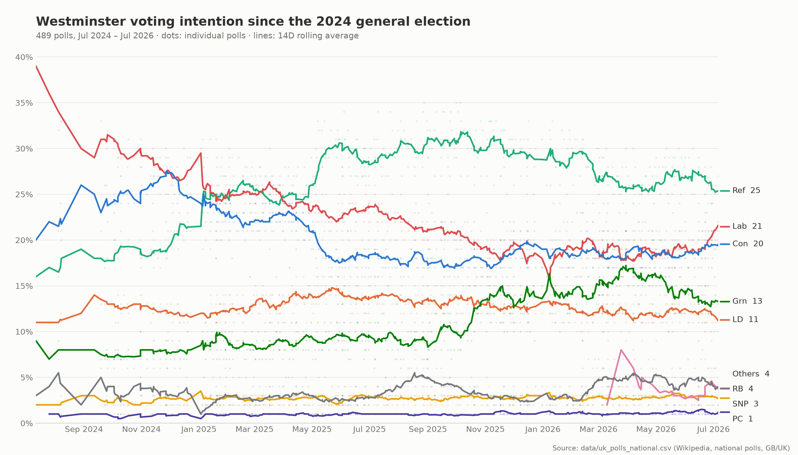
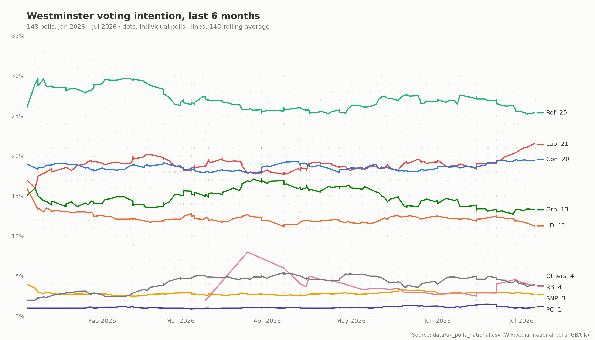
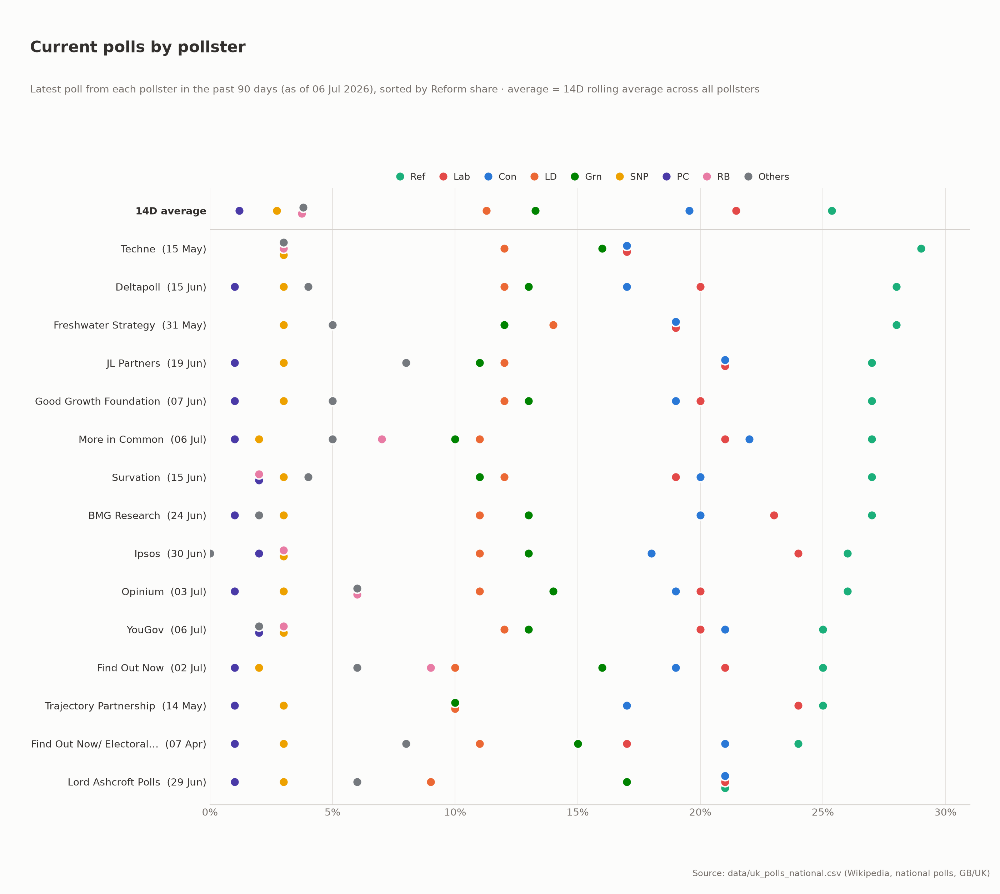
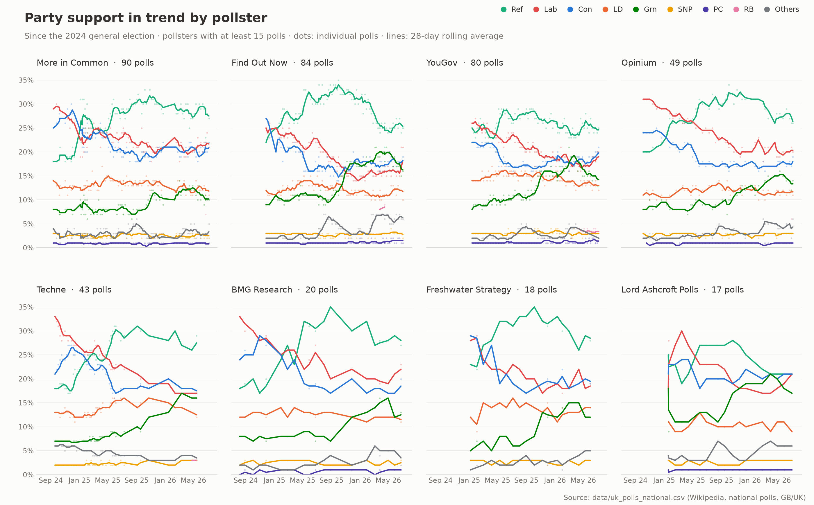

# UKPolls — UK General Election Polling Visualization

Visualizes UK Westminster voting-intention polling data, scraped from
[Wikipedia's "Opinion polling for the next United Kingdom general election"](https://en.wikipedia.org/wiki/Opinion_polling_for_the_next_United_Kingdom_general_election)
into `data/uk_polls_national.csv`, as PNG charts.

The main chart plots every individual poll as a faint dot, with a 14-day
rolling-average trend line per party, from the July 2024 general election
through the present:



A second chart zooms into the last six months for a closer read of the
current state of the race:



A third chart compares pollsters ("house effects"): each row is a pollster's
most recent poll from the past 90 days, sorted by Reform UK share, with the
all-pollster rolling average on top for reference:



A fourth chart breaks the party trends down by pollster as small multiples —
one panel per pollster with at least 15 polls since the 2024 election, all on
the same scale, with a wider 28-day rolling window since pollsters poll at
very different rates:



## Usage

Requires [uv](https://docs.astral.sh/uv/) and Python ≥ 3.14. Dependencies
(pandas, matplotlib) are managed in `pyproject.toml`.

```sh
uv run main.py
```

This writes all four PNGs. Options:

```sh
uv run main.py --csv path/to/polls.csv --out chart.png --out-recent recent.png
```

### Parser (stdlib only, no uv needed)

Fetch the raw wikitext and regenerate the CSV:

```sh
curl -s "https://en.wikipedia.org/w/index.php?title=Opinion_polling_for_the_next_United_Kingdom_general_election&action=raw" -o /tmp/uk_raw.wiki
python3 parse_polls.py /tmp/uk_raw.wiki data/uk_polls_national.csv
```

## Data

`data/uk_polls_national.csv` contains one row per national poll from the
"National poll results" section of the Wikipedia article (2024–present):

| Column | Description |
|---|---|
| `date` | End of fieldwork (used as the poll's date) |
| `pollster` | Polling company (YouGov, More in Common, Opinium, …) |
| `client` | Commissioning outlet, where disclosed |
| `area` | `GB` (Great Britain) or `UK` (includes Northern Ireland) |
| `sample_size` | Respondents |
| `Lab`, `Con`, `Ref`, `LD`, `Grn`, `SNP`, `PC`, `RB` | Party vote shares in percent (blank where not reported or not yet founded) |
| `Others` | Combined share of all remaining parties |
| `survey_start` | Start of fieldwork |

SNP is only contested in Scotland and Plaid Cymru (PC) only in Wales, so both
are generally lower nationally than their within-nation polling. Restore
Britain (RB) is blank before the party existed.

## Chart design

- **Dots** are individual polls (semi-transparent); **lines** are 14-day
  rolling averages, so sparse series (RB, before it had wide poll coverage)
  plot correctly.
- A vertical dashed line marks the 2024 general election.
- Colors are drawn from a validated CVD-safe categorical palette (see the
  `dataviz` skill's `validate_palette.js`) rather than pure party brand hex —
  Reform's teal and Labour's red in particular were shifted to clear
  colorblind separation from the Lib Dem/SNP and Green slots. Every line is
  directly labeled with its latest average, so no series is identified by
  color alone.

## Parser (`parse_polls.py`)

The Wikipedia article's national-polls table is a hand-edited MediaWiki
wikitable, one per year (2024, 2025, 2026 sections), whose column set changes
over time (Restore Britain's column only appears from 2026). `parse_polls.py`
parses this generically rather than assuming a fixed column layout:

- Reads each year's header row to determine the party columns for that table.
- Reconstructs full rows from wikitext's `rowspan`/`colspan` cell-merging
  (used e.g. for "Did not exist" placeholders before a party was founded),
  tracking which columns are still "owned" by an earlier row.
- Tokenizes cells with `{{ }}` / `[[ ]]` / `<ref>...</ref>` depth-tracking, so
  citation templates that span multiple lines or contain literal `|`
  characters aren't mistaken for cell boundaries.
- Parses the `{{opdrts|...}}` fieldwork-date template, including cross-month
  and cross-year day ranges (e.g. `{{opdrts|31|7|June|2026}}` → 31 May–7 June
  2026).
- Skips full-width event-annotation rows (e.g. leadership changes) via their
  wide `colspan`.
